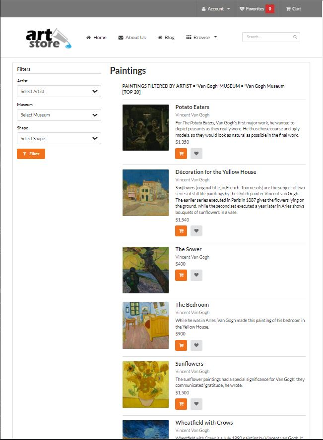
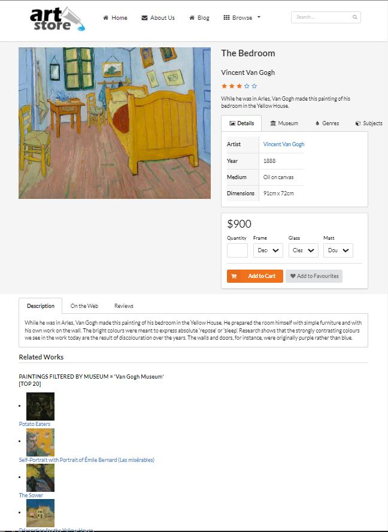
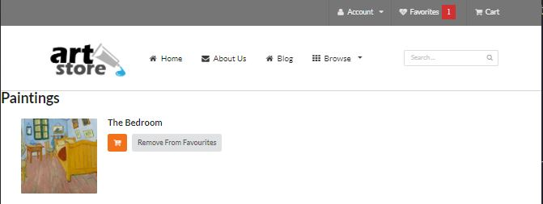

# Art Store

by Bardia Parmoun

Released on: 12/01/2021

## Description

- This program simulates an online art store.
- The users have the option to fiter the paintings based on the artist name, museum, and the shape of the painting.
- When a user likes a painting they can select the heart button to add the painting to the list of favourites.
- By click on each painting the users can learn more about the painting, its genres, its artist, and its reviews.

## Running the program
- This website was created using PHP and SQL. 

In order to run the program make sure to have the following installed:

1. Make sure XAMPP (or LAMP) is installed and running so you can have an instance of an Apache server and a MySQL server running. The application can be installed from the following link:

[Install XAMPP](https://www.apachefriends.org/download.html)

2. Once XAMPP is installed make sure you have a local version of the book store database. The DDL file for the database is located under the SQL folder.

3. In order to take advantage of caching in the assignment make sure you have memcache installed:

The version of XAMPP and memcached used in this assignment can be found using on the following drive:

[Click here for the installation links!](https://drive.google.com/drive/folders/1vdFZ2BPlWMoAgCF3yh4MqtRgMg2j3Lcl?usp=sharing)

4. Once everything is installed simply move the folder to the "htdocs" under your XAMPP installation folder so you can then access it via localhost.

```
http://localhost/art-store/browse-paintings.php
```

## How does the website work?
- The main entry point of the program is the "browse-paintings.php" which consists of different filters that can be used to filter the paintings and present the results to the user.
<p align="center">
    
</p>

- Clicking on each painting takes the user to the "single-painting.php" which presents more information about the individual painting. These include the artist, the gallery, reviews, etc.
<p align="center">
    
</p>

- The paintings can be added to the favourites list which will take the user to the "addToFavourites.php" and then the "view-paintings.php" page.
- Once on the favourites page the user has the option to remove the painting from their favourite list.
  
<p align="center">
    
</p>
- Finally the result of each filtering and the drop down menus are cached using the memcached service. This allows the users to access their previous searches using caches in case their connection to the database is lost in any chance.

## What's next?
- The website should also present the option for the users to add the paintings to their cart and checkout which is not implemented in this submission.
